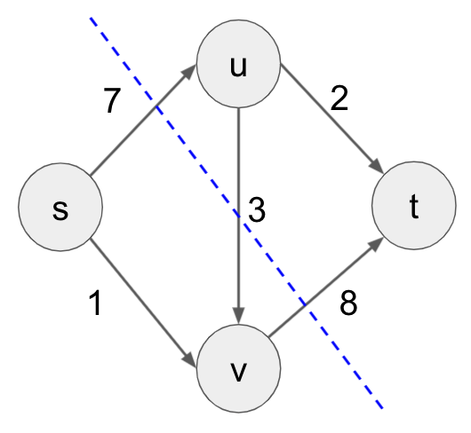

# Homework 7: Kruskal's & Network Flow

The goal of this homework is to more deeply explore what we've covered in the MST and Network Flow lectures. This homework is slightly different than others in that it requires you to learn new material not covered in-depth in class, and there is no coding. It is due April 11 at 11:59pm.

### Submitting & Grading
In order to submit this assignment, you must download as a ZIP file and upload it to Gradescope. Please include all files.

Your grade on this homework will be out of 14 points.

### Corrections
If you miss points on this assignment, there will be an opportunity to earn some back by doing homework corrections, so don't worry about the grade if you're having a tough time on some of the questions.

### Academic Integrity
Remember that you can consult outside resources and work with other students as long as you write up your own solutions and cite any links or people you received help from within `citations.txt`.

### Instructions
For each of the questions below, please write your answers in `Q1.txt`, `Q2.txt`, `Q3.txt`, and `Q4.txt`.

## Q0. Learning about Disjoint Sets

I highly recommend watching 1 (<30 minute video) or reading 2 before you start Q1 and Q2:
- (1) If you prefer a lecture format, this is a [really good video resource](https://www.youtube.com/watch?v=wU6udHRIkcc) (as a general note, this person’s lectures are high quality across the board). Slight terminology differences in this video from the HW and textbook: he uses “weighted union” which is similar to the “union by rank”, and he says “collapsing find” which is essentially “path compression”.
- (2) If you prefer a written resource, Ch 21 in the textbook is fully dedicated to the topic. You can skip over the exercises and detailed math proofs to understand the main ideas, and they are very similar to the ideas explained in the video.

## Q1. Disjoint Sets in Kruskal's (2 points)
In class, we showed an abbreviated version of Kruskal's pseudocode. The actual pseudocode looks like this:
```
algorithm kruskal(G, w)
  Input: A connected undirected graph G = (V, E) with edge weights w(u, v) for all (u,v) in E
  Output: A minimum spanning tree defined by the edges X

  for all u ∈ V:
    makeset(u)
  X = {}
  Sort the edges E by weight
  for all edges {u, v} ∈ E, in increasing order of weight:
    if find(u) != find(v):
      add edge {u, v} to X
      union(u, v)
  return X
```

Recall during the Kruskal's lecture how we would make sure that adding an edge between two nodes would not create a cycle. A data structure called "Disjoint Sets" allow us to do this efficiently by keeping track of / updating a "set" for each connected component.

We have 3 functions related to Disjoint Sets:

1. makeset(x), which takes in a node x and creates a new set with just x in it.
2. find(x), which takes in a node and returns which set it belongs to.
3. union(x, y), which takes in two sets, and combines them into one big set.

In `Q1.txt`, answer each of the below:
- How many times will we call `makeset` within Kruskal's? Put your answer in terms of |V| and |E|.
- How many times will we call `find` within Kruskal's? Put your answer in terms of |V| and |E|.
- How many times will we call `union` within Kruskal's? Put your answer in terms of |V| and |E|.
- Describe using your own words why `find(u) != find(v)` is the same as "if this edge doesn't cause a cycle".

## Q2. Union-Find (3 points)

Now here's the code for the Disjoint Set functions above:
```
algorithm makeset(x)
  Input: a graph node x
  Output: modify x such that it has a "rank" and a "parent"

  x.rank = 0
  x.parent = x

algorithm find(x)
  Input: a graph node x
  Output: the ancestor

  if x != x.parent
    x.parent = find(x.parent)
  return x.parent

algorithm union(x, y)
  Input: graph nodes x and y
  Output: modify x and y so that they are now connected in the same "set"

  x = find(x)
  y = find(y)

  if x.rank > y.rank
    y.parent = x
  else
    x.parent = y
    if x.rank == y.rank
      y.rank = y.rank + 1
```

In `Q2.txt`, answer each of the below:
- Suppose we make the following sequence of calls: `makeset(A); makeset(B); makeset(C); makeset(D); union(C, D); union(A, B); union(A, B); union(B, D);`. Draw what the set(s) look like at this point (either a picture or text representation is fine).
- You call `find(x)` on the above and it takes multiple recursive calls, then you call `find(x)` again on the same node and it takes fewer. What is `x`? This phenomena is called "path compression".
- Draw what the set(s) look like after the additional `find` calls. 
- What does rank signify for each node?


## Q3. Sibling Rivalry
Two siblings, Alice and Bob, dislike each other so much that they refuse to walk to school together from their house. Not only that, but they refuse to walk along any block that their sibling has stepped on that day. They are okay for their route to cross at corners (and luckily, both their house and the school are on corners).

**Q3.A (3 points)** We are given a directed graph G with vertices representing different corners and directed edges between them representing blocks (for simplicity, let's assume they are "one-way" blocks). We want to design an algorithm to determine whether it will be possible for Alice and Bob to get to school using max-flow. If it is possible, we want to generate the two paths. Solve this problem using a network flow network.

Be sure to address each of the following in your answer:
- What is the source?
- What is the sink?
- What are the edge capacities?
- How will we know it is possible for them to each go to school?
- Assuming it's possible to find two such paths, how will we use the flow graph to find the paths they should take?

**Q3.B (2 points)** The relationship tension has only increased with a few coincidental run-ins at corners. Now, they refuse to even cross corners that their sibling has crossed on that day (aside from the house and school). What graph transformation can we apply to our approach in Q3.A to represent this new constraint? Be sure to explain in detail which vertices or edges will be modified and how they will be modified.


## Q4. Network Flow Cuts

An *s-t cut* of a flow network is a partitioning of nodes into two groups, one which contains the source s and the other which contains the sink t. 

The image above represents the cut {s, v} / {u, t}. The *cut capacity* is the sum of all edge capacities that **go from the set containing s to the set containing t**. So the cut capacity shown above is 7 + 8 = 15 (note that we do not include 3).

**Q4.A (1 point)** Define all 4 s-t cuts in the graph above and calculate their capacities. The [Max-Flow Min-Cut Theorem](https://en.wikipedia.org/wiki/Max-flow_min-cut_theorem) states that the max flow in a network is equal to the capacity of the s-t cut with minimum capacity. Using this, what is the max flow of this network?

**Q4.B (2 points)** Find and list flow values for each edge that will give this max-flow. What do you notice about the flows of the edges along the minimum s-t cut? Use this observation to explain why the max-flow min-cut theorem makes intuitive sense.


## Q5. Feedback (Not Graded)

Your responses to these questions will not affect your grade. They help improve or adjust homework assignments or lecture material in the future. 

**Q5.A** Approximately how much time (in hours) did you spend on this homework?
- <2 hours
- 2 - 4 hours
- 4 - 6 hours
- 6 - 8 hours
- 8 - 10 hours
- 10 - 12 hours
- \>12 hours

**Q5.B** Which problem was the most difficult? Any other thoughts?

